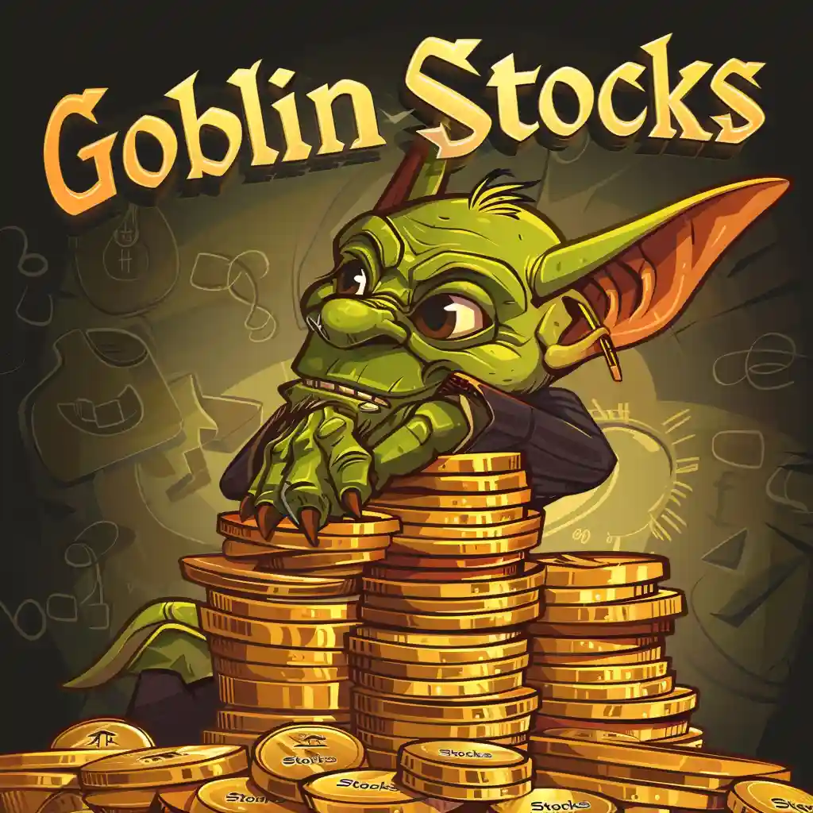
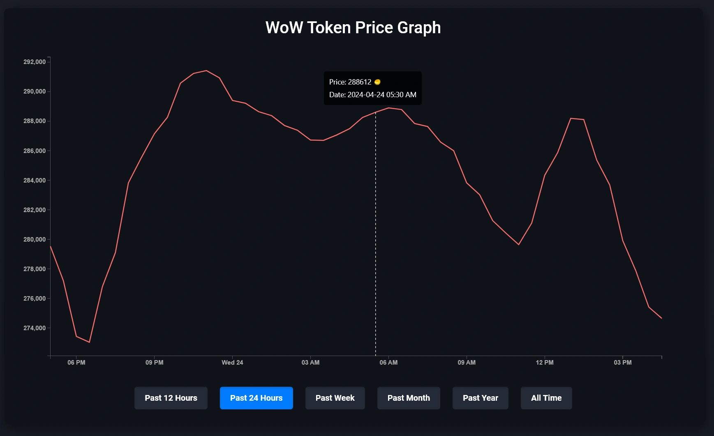

<a name="readme-top"></a>


<!-- PROJECT LOGO -->
<br />
<div align="center">
  <a href="https://github.com/Eric-Lighthall/goblin-stocks">
    
  </a>

<h3 align="center">Goblin Stocks</h3>

  <p align="center">
    Goblin Stock is a web service that provides both real-time and historical data on World of Warcraft token prices. It enables players and market analysts to track price fluctuations and trends, helping them make informed decisions in the game's economy.
    <br />
    <a href="https://github.com/Eric-Lighthall/goblin-stocks">View Demo</a>
    ·
    <a href="https://github.com/Eric-Lighthall/goblin-stocks/issues/new?labels=bug&template=bug-report---.md">Report Bug</a>
    ·
    <a href="https://github.com/Eric-Lighthall/goblin-stocks/issues/new?labels=enhancement&template=feature-request---.md">Request Feature</a>
  </p>
</div>


<!-- ABOUT THE PROJECT -->
## About The Project

<h3 align="center"></h3>


### Built With

* [![Node][Node.js]][Node-url]
* [![Express][Express.js]][Express-url]
* [![Javascript][Javascript]][Javascript-url]
* [![MongoDB][MongoDB]][Mongo-url]
* [![D3][D3.js]][D3-url]
* [![HTML5][HTML5]][HTML-url]
* [![CSS3][CSS3]][CSS-url]
* [![Render][Render.com]][Render-url]


<!-- GETTING STARTED -->
## Getting Started

To get a local copy up and running follow these simple example steps.

### Local Development

1. Clone the repo
   ```bash
   git clone https://github.com/Eric-Lighthall/goblin-stocks.git
   ```
2. Install NPM packages
   ```bash
   npm install
   ```
3. Start 
   ```bash
   node server.js
   ```

This will launch Goblin Stocks at http://localhost:3000


<!-- USAGE EXAMPLES -->
## Self Hosting

The self-hosted version of Goblin Stocks is under active development and may contain bugs and other issues. Please use it for testing and evaluation purposes only.


<!-- CONTRIBUTING -->
## Contributing

Contributions are what make the open source community such an amazing place to learn, inspire, and create. Any contributions you make are **greatly appreciated**.

If you have a suggestion that would make this better, please fork the repo and create a pull request. You can also simply open an issue with the tag "enhancement".

1. Fork the Project
2. Create your Feature Branch (`git checkout -b feature/AwesomeFeature`)
3. Commit your Changes (`git commit -m 'Add some AwesomeFeature'`)
4. Push to the Branch (`git push origin feature/AwesomeFeature`)
5. Open a Pull Request


<!-- LICENSE -->
## License

Distributed under the MIT License. See `LICENSE.txt` for more information.


<!-- CONTACT -->
## Contact

Your Name - [@EricLighthall](https://twitter.com/EricLighthall) - ericlighthall2@gmail.com

Project Link: [https://github.com/Eric-Lighthall/goblin-stocks](https://github.com/Eric-Lighthall/goblin-stocks)

<p align="right">(<a href="#readme-top">back to top</a>)</p>


<!-- MARKDOWN LINKS & IMAGES -->
[Node.js]: https://img.shields.io/badge/Node.js-43853D?style=for-the-badge&logo=node.js&logoColor=white
[Node-url]: https://nodejs.org/
[Express.js]: https://img.shields.io/badge/Express.js-404D59?style=for-the-badge
[Express-url]: https://expressjs.com/
[MongoDB]: https://img.shields.io/badge/MongoDB-4EA94B?style=for-the-badge&logo=mongodb&logoColor=white
[Mongo-url]: https://www.mongodb.com/
[Javascript]: https://img.shields.io/badge/JavaScript-F7DF1E?style=for-the-badge&logo=javascript&logoColor=black
[Javascript-url]: https://www.javascript.com/
[HTML5]: https://img.shields.io/badge/HTML-239120?style=for-the-badge&logo=html5&logoColor=white
[HTML-url]: https://html5.org/
[CSS3]: https://img.shields.io/badge/CSS3-1572B6?style=for-the-badge&logo=css3&logoColor=white
[CSS-url]: https://angular.io/
[Render.com]: https://img.shields.io/badge/Render.com-404D59?style=for-the-badge
[Render-url]: https://render.com/
[D3.js]: https://img.shields.io/badge/d3%20js-F9A03C?style=for-the-badge&logo=d3.js&logoColor=white
[D3-url]: https://d3js.org/
